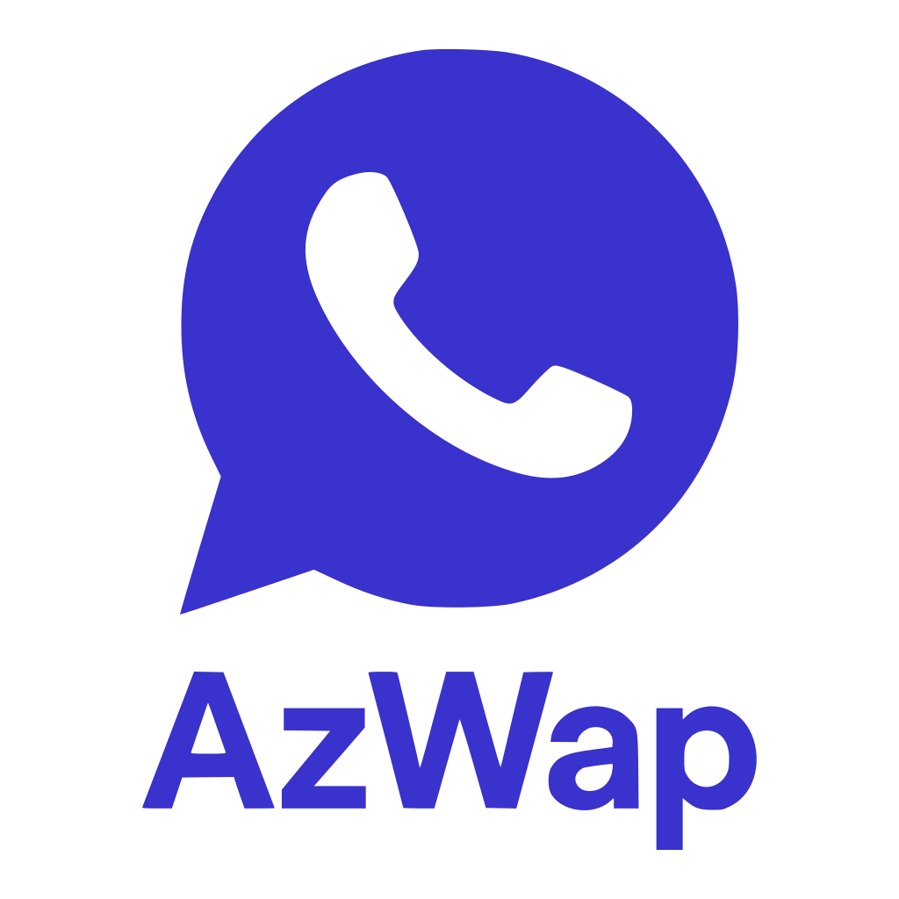

<!-- markdownlint-disable MD041 -->
<!-- markdownlint-disable-next-line MD033 -->
<div align="center">
  <!-- markdownlint-disable-next-line MD033 -->
  

# AZ-WAP Enterprise v2.0 BETA
### High-Performance Multi-Channel AI Orchestration Engine

[](https://github.com/AzielCF/az-wap/releases)
[](https://github.com/AzielCF/az-wap/actions)
[](LICENSE)

> [!WARNING]
> **PRE-RELEASE / BETA STATUS**: This version (v2.0 Beta) is currently in active development. As a pre-release, unexpected behaviors, bugs, or breaking changes may occur until the first stable version is officially published. Use in production environments with caution.


**AZ-WAP** is a next-generation, enterprise-grade **multi-channel AI orchestration engine**. While currently optimized as a high-performance WhatsApp gateway, it is engineered for massive scale, multi-tenant management, and sovereign AI integration across multiple communication networks. Built on a strict **Hexagonal Architecture**, it enables businesses to handle hundreds of concurrent interaction nodes with absolute stability and AI intelligence.

</div>

---

## 🌟 Vision & Roadmap

> [!NOTE]
> **AZ-WAP** is under constant development. Our mission is to build the most advanced AI agent system for personal assistants and professional use cases across multiple environments.

### The Objective:
Our goal is to transcend simple messaging. We are crafting a highly sophisticated, **channel-agnostic AI ecosystem** that learns, remembers, and acts as a true autonomous assistant. While WhatsApp is our primary production channel today, AZ-WAP is engineered to be a universal orchestration layer, progressively expanding into other networks and interaction environments.

---

## 📑 Table of Contents
- [🌟 Vision & Roadmap](#-vision--roadmap)
- [✨ Key Features](#-key-features)
- [🏗️ System Architecture](#-system-architecture)
- [💎 Global Client & Tier System](#-global-client--tier-system)
- [🤖 Advanced AI Bot Engine](#-advanced-ai-bot-engine)
- [🚀 Quick Start Guide](#-quick-start-guide)
- [⚙️ Configuration Manual](#-configuration-manual)
- [📂 Project Structure](#-project-structure)
- [📡 API & Webhooks](#-api--webhooks)
- [⚖️ Licensing & Governance](#-licensing--governance)
- [📩 Contact & Support](#-contact--support)

---

## ✨ Key Features

- **Hybrid State Management**: High-performance architecture that utilizes **Valkey Engine** (Redis-compatible) for distributed session management and presence. If Valkey is unavailable, the system automatically falls back to **Native Server RAM**, ensuring zero-downtime and ultra-low latency for single-node deployments.
- **Bot Variants & Granular Scoping**: Assign specific bot profiles (Staff, Guest, Business) per client. Each variant defines its own allowed tools, system prompts, and capability flags (Audio, Vision, Memory).
- **Privacy & Audit Modes**:
    - **Safe Mode**: Messages and session content are kept strictly private and invisible to system administrators when `AccessModePrivate` is enabled.
    - **Tester Mode**: Specialized `IsTester` flag for development environments, enabling full log auditing and un-redacted AI traces for debugging.
- **Enterprise Multi-Tenant Isolation**: Built from the ground up for SaaS. Features Attribute-Based Access Control (ABAC), decoupled workspaces, custom capability toggles per client, and strict data siloing.
- **Standalone Passwordless Client Portal**: A dedicated environment for end-clients to manage their own Workspaces, view their analytics, and control their WhatsApp lines securely using **Magic Links** and isolated **JWT** authentication—keeping the main admin core unreachable.
- **Autonomous Sovereign Agents**: Natively integrated with Gemini, OpenAI, and Anthropic. The AI ecosystem supports complex **Tool-Calling** schemas, stateful memory persistence across sessions, and distinct customizable **Bot Variants**.
- **Human-Like Simulation**: Advanced presence logic including randomized typing indicators, audio-recording simulations, and smart connection hibernation to drastically reduce the risk of WhatsApp bans in cold campaigns.
- **Premium Admin Command Center**: A master unified Vue 3 + DaisyUI dashboard to orchestrate the entire platform in real-time. Create accounts, toggle permissions, force-logout lines remotely, and monitor global AI traces.
- **Native Chatwoot Synchronization**: Bi-directional communication architecture designed for seamless handoffs between AI agents and human enterprise customer support workflows.
- **Model Context Protocol (MCP)**: Run AZ-WAP as an authorized MCP server, instantly granting physical WhatsApp and bot-configuration capabilities to external AI ecosystems.

---

## 🏗️ System Architecture

AZ-WAP is built using **Clean Hexagonal Architecture**, ensuring the business logic remains pure and decoupled from external drivers.

### Core Layers:
1.  **Domain**: Contains the pure business logic, entities (Bot, Workspace, Client, PortalAccount), and port interfaces.
2.  **Application (Use Cases)**: Orchestrates the flow of data between the Domain and Infrastructure.
3.  **Infrastructure (Adapters)**:
    *   **WhatsApp Adapter**: High-availability driver built on `whatsmeow`.
    *   **State Engine (Hybrid)**: Centralized state management using **Valkey** (distributed/Redis-compatible) with an automatic **Local RAM** fallback for standalone deployments.
    *   **AI Providers**: Dynamic adapters for Gemini, VertexAI, etc.
    *   **Persistence**: Repository implementations for SQLite and PostgreSQL.
    *   **REST/MCP Adapters**: Interface layers for external communication.

---

## 💎 Global Client & Tier System

AZ-WAP includes a robust multi-tenant infrastructure designed to scale. The system supports a flexible subscription model where capabilities can be dynamically toggled and restricted based on the client's tier.

### Dynamic Resource Management
- **Modular Capabilities**: Tiers can be configured to enable or disable specific features like AI Vision, Audio processing, or Proactive Memory.
- **Resource Quotas**: Manage workspace limits and message throughput per client.
- **Scalable Tiers**: The platform is prepared for Standard, Premium, VIP, and Enterprise classifications, with configurations that can be adjusted through the administration layer.


---

## 🛠️ Native Toolset & AI Intelligence

AZ-WAP exposes a suite of optimized native tools that the AI can invoke to interact with the real world:

- **Financial Tool (`exchange_rate_tool`)**: Real-time currency conversion with support for global Fiat currencies.
- **Smart Scheduler (`reminder_tool`)**: Advanced scheduling engine for tasks and notifications with relative time parsing (e.g., "remind me in 2 hours") and recurrence support.
- **Resource Analytics (`analyze_resource`)**: Contextual processing of documents, links, and media shared within sessions.
- **Group Management (`group_tool`)**: Administrative control over WhatsApp groups (members, settings, and metadata).
- **Newsletter Engine (`newsletter_tool`)**: Control over scheduled broadcast posts and large-scale delivery management.
- **External Extension (**MCP Servers**)**: Native support for **Model Context Protocol**, allowing the system to consume external AI tools and APIs securely.

### Proactive Decision Making
The AI doesn't just respond; it analyzes the conversation flow to determine if it should trigger a tool, record a voice note, or save a memory to the persistent profile. Its multimodal core allows for real-time analysis of Images, Videos, and Documents.

---

## 🚀 Quick Start Guide

### Prerequisites
- **Go 1.24+** (Modern Go features required)
- **Node.js 20+** & **Bun** (Frontend package manager)
- **FFmpeg** (Required for media conversion)
- **Valkey / Redis** (Required for distributed state and session management)
- **SQLite / PostgreSQL**

### Backend Setup
```bash
cd src
go mod tidy
# Run in REST API mode
go run . rest
```

### Frontend Setup
```bash
cd src/frontend
bun install
bun dev
```

### Environment Synchronization
Copy `.env.example` to `.env` inside the `src` folder and configure your keys.

---

## ⚙️ Configuration Manual

AZ-WAP exposes a highly configurable environment. Use the `.env.example` as your baseline. Below are the critical subsets:

### 1. Application Core & Security
| Variable | Description |
| :--- | :--- |
| `APP_PORT` | The main listener port (Default: `3000`). |
| `APP_BASIC_AUTH` | Master dashboard credentials (e.g., `user1:pass1,user2:pass2`). |
| `APP_CORS_ALLOWED_ORIGINS` | Comma-separated list for strict CORS policies. |
| `APP_TRUSTED_PROXIES` | Define trusted network proxies (e.g., `0.0.0.0/0`) for accurate IP resolution behind Nginx/Cloudflare. |

### 2. Databases & State Engines
| Variable | Description |
| :--- | :--- |
| `DB_URI` | URI for the main relational database (SQLite/PostgreSQL). |
| `DB_KEYS_URI` | Separate database exclusively for cryptographic keys and WhatsApp session metadata. |
| `VALKEY_ENABLED` | Flag (`true`/`false`) to activate the distributed Valkey engine. |
| `VALKEY_ADDRESS` | Network address for your Valkey/Redis cluster (e.g., `localhost:6379`). |

### 3. Portal & Client Access
| Variable | Description |
| :--- | :--- |
| `PORTAL_INTERNAL_KEY` | Master key allowing internal bots to securely generate Magic Links for clients. |
| `PORTAL_JWT_SECRET` | A completely isolated secret specifically for signing Client Portal session tokens. |

### 4. Hardware Integrations (WhatsApp)
| Variable | Description |
| :--- | :--- |
| `WHATSAPP_ACCOUNT_VALIDATION` | Toggles strict validation checks on WhatsApp business profiles upon connection. |

## 📂 Project Structure

```text
az-wap/
├── docs/               # Technical specs & OpenAPI documentation
├── src/                # Core implementation
│   ├── botengine/      # AI Intelligence Layer (Hexagonal)
│   ├── workspace/      # Session Management (Hexagonal)
│   ├── clients/        # Multi-tenant Administration
│   ├── clients_portal/ # Passwordless Client Portal (Hexagonal)
│   ├── infrastructure/ # External Adapters (WA, DB, Valkey)
│   ├── domains/        # Shared Business Entities
│   ├── frontend/       # Enterprise Vue 3 Admin Dashboard
│   └── main.go         # Application Entry Point
├── docker/             # Containerization assets
└── LICENSE             # Dual-License Agreement
```

---

## 📡 API & Webhooks

### REST API Highlights
- **Auth**: Bearer Token or Basic Auth.
- **Media**: Native support for File ID and URL-based sending.
- **Webhooks**: Signed payloads with retry logic and sequential processing.

### Event System
AZ-WAP emits events for:
- `message_received`: Incoming text/media.
- `session_status`: QR ready, Connected, Disconnected.
- `ai_thinking`: Bot start/end processing.
- `client_limit_reached`: Resource exhaustion warnings.

---

## ⚖️ Licensing & Governance

**AZ-WAP** is a **Dual-Licensed** product.

- **Open Source (GNU AGPL v3.0)**: Free for community, personal, and educational use. Any derived work must remain open source.
- **Commercial License**: **MANDATORY** for any legal entity generating **>$20,000 USD** in annual gross revenue. 

### Contribution Agreement
By submitting code, you agree to assign all rights to the original authors as per the **Rights Assignment Clause** in the `LICENSE` file. This allows the project to maintain commercial viability while remaining free for the community.

**Jurisdiction**: Laws of **Peru**.

---

## 📩 Contact & Support

- **Lead Developer**: [Aziel Cruzado](https://azielcruzado.com)
- **Business Email**: [contacto@azielcruzado.com](mailto:contacto@azielcruzado.com)
- **Issues**: [GitHub Issue Tracker](https://github.com/AzielCF/az-wap/issues)

___
<div align="center">
  <p>Copyright (c) 2025-2026 <b>Aziel Cruzado</b>. All rights reserved.</p>
</div>